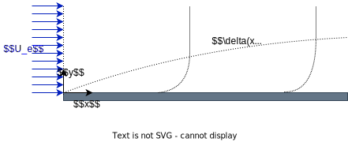

# Numerical Solution of The Blasius Boundary Layer Equation over a Flat Plate

## ENGR 6201: Fluid Mechanics

**Professor:** Ida KarimFazli

**Student's Name:** Dara Rahmat Samii

**Student's ID number:** 40281972

**Date:** November 2023

---
## Project Overview

This project involves the numerical solution of the Blasius Boundary Layer Equation over a flat plate. The Blasius equation is a fundamental solution in fluid mechanics that describes the

### Problem Description

Consider a hypothetical scenario where a flat plate is subjected to a uniform flow with a constant velocity denoted as \( U_e \). The primary objective is to characterize the profiles of velocity and boundary layer thickness as the fluid progresses along the plate.

The mathematical description involves the incompressible Navier-Stokes equations, which, under carefully defined assumptions, transform into a specialized system recognized as the Blasius equations:

$\frac{\partial u}{\partial t} + u\frac{\partial u}{\partial x} + v\frac{\partial u}{\partial y} = - \frac{1}{\rho}\frac{\partial P}{\partial x} + \nu \left(\frac{\partial ^2 u}{\partial x^2} + \frac{\partial ^2 u}{\partial y^2}\right)$

$\frac{\partial v}{\partial t} + u\frac{\partial v}{\partial x} + v\frac{\partial v}{\partial y} = - \frac{1}{\rho}\frac{\partial P}{\partial y} + \nu \left(\frac{\partial ^2 v}{\partial x^2} + \frac{\partial ^2 v}{\partial y^2}\right)$

$\frac{\partial u}{\partial x} + \frac{\partial v}{\partial y} = 0$

### Given Values

For this practical problem, the following values are provided for the length of the plate, fluid density, and viscosity:

$L = 1m \quad \rho = 1.2 \frac{kg}{m^3} \quad \mu = 1.7 \times 10^{-7} Pa.s$

### Schematic

	

--- 
# File Descption
`Matlab` contains all codes necessary for solivg the problem
`Plots` contains all generated results
`LaTeX Source` contatin source of report in latex
